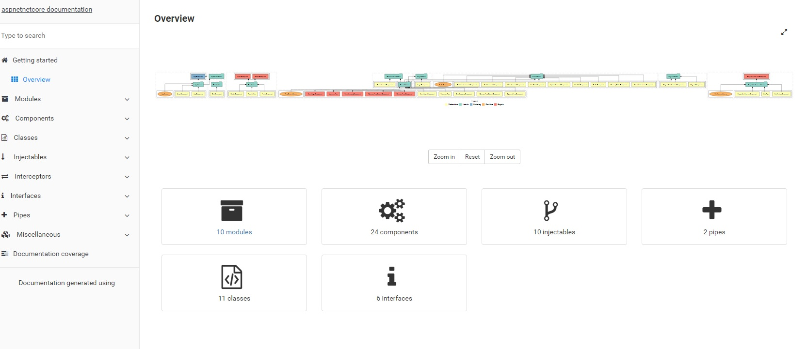

[](https://github.com/asadsahi/aspnetcorespa/actions?query=workflow%3AWEB)
[](https://github.com/asadsahi/aspnetcorespa/actions?query=workflow%3ASTS)
[](https://asadsahi.visualstudio.com/playground/_build/latest?definitionId=20&branchName=master)
[](https://ci.appveyor.com/project/asadsahi/aspnetcorespa)
[](http://opensource.org/licenses/MIT)

## Features

- [ASP.NET Core 3.1](http://www.dot.net/)
- [Entity Framework Core 3.1](https://docs.efproject.net/en/latest/)
  - Both Sql Server and Sql lite databases are supported (Check installation instrcutions for more details)
- [Identity Server 4](http://identityserver.io/)
- [Angular 8](https://angular.io/)
- [Angular CLI 8](https://cli.angular.io/)
- Secure - with CSP and custom security headers
- [SignalR](https://github.com/aspnet/SignalR/)
- [SASS](http://sass-lang.com/)
- Best [practices](https://angular.io/docs/ts/latest/guide/style-guide.html) for Angular code organisation.
- [Clean Architecture](https://github.com/ardalis/CleanArchitecture) for ASP.Net Core code.
- [PWA support](https://developers.google.com/web/progressive-web-apps/)
- [SSR (Server side rendering)](https://angular.io/guide/universal) - Coming soon...
- Fast Unit Testing with [Jest](https://facebook.github.io/jest/).
- E2E testing with [Protractor](http://www.protractortest.org).l
- [Compodoc](https://compodoc.github.io/compodoc/) for Angular documentation
- Login and Registration functionality using [Identity Server implicit flow](http://identityserver.io/)
- Extensible User/Role identity implementation
- Social logins support with token based authentication, using [Identity Server](http://identityserver.io/)
- [Angular dynamic forms] for reusable and DRY code.
- [Swagger](http://swagger.io/) as Api explorer (Visit url **https://127.0.0.1:5005/swagger** OR whatever port visual studio has launched the website.). More [details](https://github.com/domaindrivendev/Swashbuckle.AspNetCore)

## Pre-requisites

1. [.Net core 3.1 SDK](https://www.microsoft.com/net/core#windows)
2. [Visual studio 2019](https://www.visualstudio.com/) OR [VSCode](https://code.visualstudio.com/) with [C#](https://marketplace.visualstudio.com/items?itemName=ms-vscode.csharp) extension
3. [NodeJs](https://nodejs.org/en/) (Latest LTS)
4. [Microsoft SQL Server](https://www.microsoft.com/en-us/sql-server/sql-server-2017) (Optional: If MS SQL server required instead of Sqlite during development)
5. [Docker](https://www.docker.com/) (Optional: If application will run inside docker container)

## Installation

```
1. Clone the repo:
    git clone https://github.com/asadsahi/AspNetCoreSpa
2. Change directory:
    cd AspNetCoreSpa
3. Restore packages:
    dotnet restore AspNetCoreSpa.sln
4. Install npm packages:
    cd src/AspNetCoreSpa.Web/ClientApp:
    - npm install
5. Run .Net project:
    F5 from either [Visual Studio IDE](https://www.visualstudio.com/) OR [VScode] (https://code.visualstudio.com/):
    Note: If you are running using Visual Studio Code, install dev certificates using command:
    dotnet dev-certs https --trust
6. Target either Sqlite or Microsoft SQL Server

This project supports both databases OOTB.

* Run with Sqlite: (Already configured to quickly run the project)
    * Project is already setup with Sqlite specific database migrations

* Run with Microsoft SQL Server:
    * Delete `Migrations` folder from src/AspNetCoreSpa.Web
    * Change setting in appsettings.json called `useSqLite` from `true` to `false`
    * This will use `SqlServerConnectionString` connection string pointing to default instance of SQL server installed on local machine

7. Identity server for authentication:
    a. Open terminal
    b. cd AspNetCoreSpa.STS
    c. dotnet run

	2 Test users:
	Username: admin@admin.com
	Password: P@ssw0rd!
	OR
	Username: user@user.com
	Password: P@ssw0rd!

    Note: For production use Identity server hosted with appropriate configuration.
```

## Other commands

### Angular component scaffolding

Note: You need to run commands from `src/AspNetCoreSpa.Web/ClientApp` directory: More information [here](https://angular.io/cli)

### Angular tests - Using [Jest](https://jestjs.io/en/) and Angular jest [preset](https://github.com/thymikee/jest-preset-angular)

```bash
cd src/AspNetCoreSpa.Web/ClientApp

npm test
```

### Compodoc Angular documentation

- Steps to generate:
  - npm i compodoc -g
  - cd src/AspNetCoreSpa.Web/ClientApp
  - npm run compodoc
  - cd documentation
  - http-server

Compodoc documentation: 

````
### run end-to-end tests
```bash
# make sure you have your server running in another terminal (i.e run "dotnet run" command)
npm run e2e
````

### run Protractor's elementExplorer (for end-to-end)

```bash
npm run webdriver:start
# in another terminal
npm run e2e:live
```

# Azure Deploy

- You can set an environment variable for azure app deployment password
  Set-Item -path env:AzureAppPass -value passwordhere

```
From powershell:
./deploy-azure.ps1
```

# Deploy to heroku using its container service

### Replace your app name where it is `aspnetcorespa`

- dotnet publish -c release
- docker build -t aspnetcorespa ./bin/release/netcoreapp3.1/publish
- heroku login
- heroku container:login
- docker tag aspnetcorespa registry.heroku.com/aspnetcorespa/web
- docker push registry.heroku.com/aspnetcorespa/web
  Note: There is a `deploy.heroku.ps1` script included with this project which automates above steps.

# Deploy to Azure as App Service

Set-Item -path env:AzureAppPass -value passwordhere

```
From powershell:
./deploy-azure.ps1
```

---

[](https://www.paypal.com/cgi-bin/webscr?cmd=_s-xclick&hosted_button_id=RB7XESV8CP7GW)
